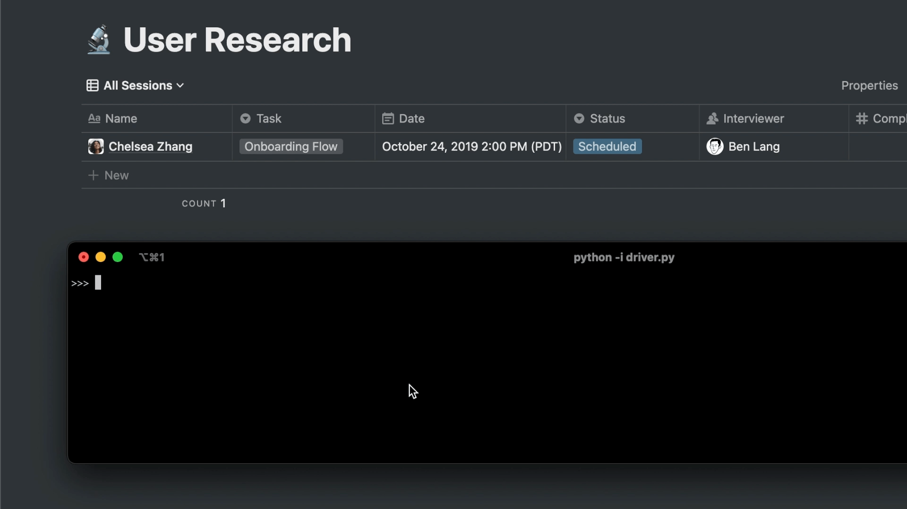

# Notion interface

This library is an abstraction of [Notion API](https://developers.notion.com/) where you could interact with the API with just a few lines of code.

  

 

## What did I learn?

- **[Dunder Method](utils/page.py)**, modify the low-level implementation of Python to simplify the use of the interface
- **PythonOOP**, write better code by reducing coupling and improving cohesion
   

## Why this project?

this project is a contribution to the open source project [Naas](https://github.com/jupyter-naas). A low code tool which enable anyone to create data products with minimal technical knowledge.
